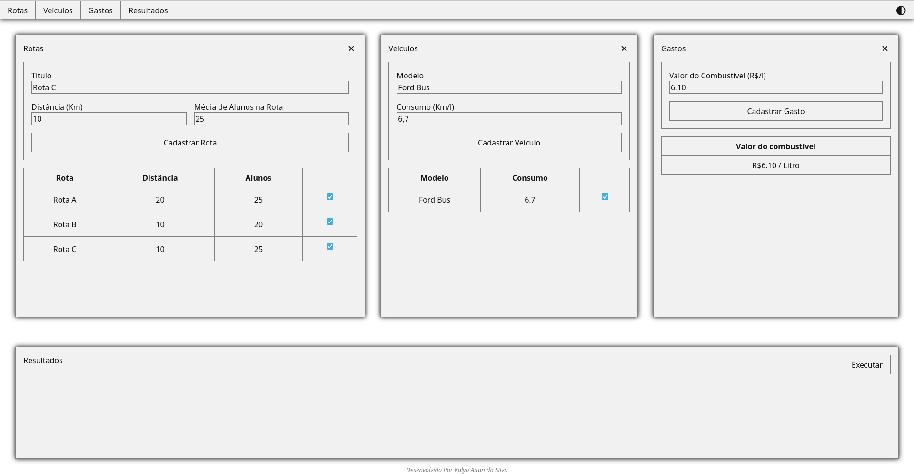
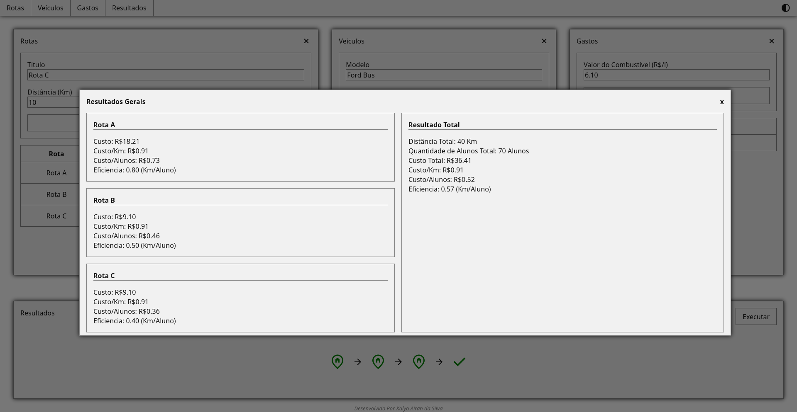

# 🚌 Projeto Transporte Escolar

Este projeto foi desenvolvido na matéria de paradigmas e linguagens de programação do curso de sistemas de informação da unidavi Turma 27 Fase 6.

## 📋 objetivo

O Objetivo deste projeto é realizar o cálculo de gastos de rotas de onibus para o transporte escolar, permitindo visualizar dados como o custo por Km, por Alunos e a eficiencia da rota.

Além disso é possivel realizar o cálculo de várias rotas simultaneamente, obtendo dados individuas sobre cada rota bem como sobre o trajeto como um todo.

## 🔌 instalação

Para utilizar o programa, basta abrir o arquivo index.html em seu navegador.

## ⚙️ Funcionalidades

 - Cadastro de rotas 
 - Cadastro de veículos
 - Cadastro de custos de combustíveis
 - Dashboard com eficiencia e resultados das rotas 

## 💻 Técnologias Utilizadas

 - HTML
 - CSS
 - Javascript

## 📁 Estrutura de Arquivos do Projeto

```
- index.html    // Página Html do sistema
- layout.css   // Página de Estilos para o sistema 
- data.js     // Arquivo de manipulação de dados
- effects.js // Arquivo de manipulação de efeitos em tela
```

## 📱 Aplicação do Paradigma Funcional

- Utilização de funções de ordem superior para manipulação de dados
- Utilização de funções puras para os cálculos e validações dos campos

## 🖼️ Exemplos de Entradas e Saídas do Sistema

Entrada


Saída


## Créditos

Desenvolvido Por [Kalyo Airan da Silva](https://github.com/kalyo-silva) | 2025